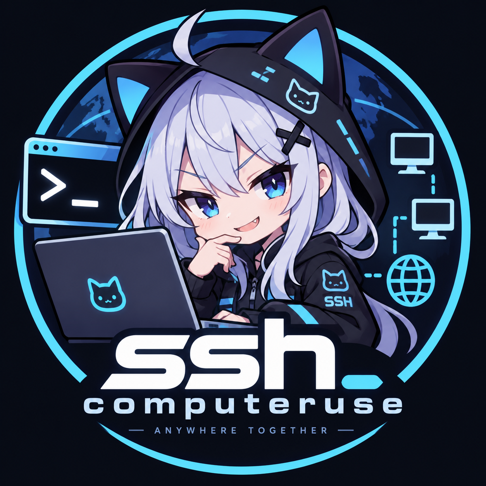

# astrbot_plugin_ssh_computer_use

<div align="center">
  
</div>

基于 **SSH** 的 AstrBot 全平台远程计算机操控插件。让 bot 稳定、顺畅地操控你的 Windows 笔记本、Linux 主机与飞牛 NAS（fnOS）——执行命令、收发文件、截屏、键鼠控制，一句话搞定 computer use。

## 它解决什么问题

| 痛点 | 本插件的做法 |
|------|--------------|
| bot 被 PowerShell 折磨（转义地狱、GBK/UTF-8 乱码、执行策略） | Windows 命令一律经 SFTP 写入临时 `.bat`（`chcp 65001`）执行；PowerShell 脚本写入 UTF-8 BOM 的临时 `.ps1` 执行。bot 全程只需要发"纯文本命令"，转义与编码由插件兜底 |
| Windows 下 SSH 会话看不到桌面、截图全黑、键鼠注入无效 | 插件把自带 `win_agent.ps1` 部署到目标机**交互式用户会话**（计划任务，免管理员），Agent 监听 `127.0.0.1`，bot 经 **SSH 端口转发**与其通信（JSON 协议），截图/键鼠/剪贴板全部在真实桌面会话内完成 |
| 截图坐标与实际屏幕对不上（缩放/多显示器） | Agent 上报虚拟屏原点与图像尺寸，插件自动把"截图像素坐标"换算成"屏幕坐标"，LLM 只管按图点击 |
| 局域网免密 + 远程 NAS 要密码 | 每台主机独立配置 `key` 或 `password` 认证，按名称切换 |

## 功能

- **命令执行**：`ssh_exec`（Windows 走 cmd / Linux 走 bash），自动重连、超时控制、输出截断
- **PowerShell**：`ssh_run_powershell` 直接执行多行脚本（无转义烦恼）
- **计算机操控（GUI）**：`computer_screenshot`（截图直接喂给多模态 LLM）、`computer_click/move/scroll/type/press_key`、`computer_exec`（用户会话内执行）、`computer_start`（启动程序/URL）、剪贴板读写
- **文件传输**：SFTP 上传/下载（聊天里发文件即可上传）、读写远程文本文件
- **LLM 工具 + 聊天命令** 双入口，并自动注入使用指南到 system prompt

## 安装

1. 将本目录放入 AstrBot 的 `data/plugins/` 下（或通过 WebUI 从仓库安装）：
   ```
   https://github.com/nagatoquin33/astrbot_plugin_ssh_computer_use
   ```
2. 依赖 `asyncssh` 会随 `requirements.txt` 自动安装；
3. 在 WebUI 插件配置中添加主机（「SSH 主机配置列表」→ 添加条目）。

## 主机配置（WebUI 结构化列表，推荐）

在插件配置的「SSH 主机配置列表」中点 **添加条目**，每台主机一张卡片，字段独立填写：

| 字段 | 说明 |
|------|------|
| 主机名称 | 唯一标识，例如 `laptop`，聊天中用 `ssh 使用 <名称>` 切换 |
| 系统类型 | `windows` / `linux` |
| 地址 / 端口 | 服务器 IP 或域名，端口默认 22 |
| SSH 用户名 | 留空使用 SSH 默认行为（bot 当前用户或 `~/.ssh/config`） |
| 认证方式 | `key`（密钥免密，推荐）/ `password` |
| SSH 密码 | password 认证时填写 |
| 私钥路径 | key 认证时可选：bot 主机上的私钥文件（支持 `~` 展开）；留空使用 `~/.ssh/` 默认密钥与 ssh-agent |
| 私钥内容 | 可选：直接粘贴 PEM 私钥（`-----BEGIN` 开头），优先于私钥路径 |
| GUI Agent 端口 | 仅 Windows 需要；0 表示使用全局默认端口 |

列表留空时回退到旧版 `hosts_text` 多行配置（兼容保留，一行一台：`名称 | windows\|linux | 用户名 | key\|password | 地址 | 端口 | 密码或私钥路径 [| Agent端口]`，`#` 开头为注释），老配置无需迁移即可继续使用。

## 项目结构

```
astrbot_plugin_ssh_computer_use/
├── main.py              # 插件入口：Star 类、装饰器注册、生命周期（薄层）
├── prompts.py           # 文案：帮助文本 / LLM 系统提示注入
├── core/                # 核心逻辑
│   ├── errors.py        #   异常类型
│   ├── models.py        #   数据模型 + 主机配置解析 + 解码工具
│   ├── base.py          #   SshTarget 基类（连接/SFTP/重试）
│   ├── windows.py       #   Windows 目标机（.bat/.ps1 文件执行）
│   ├── agent_client.py  #   Windows GUI Agent 客户端（JSON over SSH 转发）
│   ├── linux.py         #   Linux 目标机（bash + GUI 尽力而为）
│   └── pool.py          #   连接池与主机选择
├── tools/               # LLM 函数工具
│   ├── base.py          #   公共基类 + 异常包装
│   ├── ssh_tools.py     #   ssh_list_hosts / switch / exec / powershell / 文件
│   └── computer_tools.py#   computer_screenshot / 键鼠 / exec / clipboard
├── commands/            # 聊天命令解析与分发
│   └── ssh.py
└── agent/
    └── win_agent.ps1    # 部署到 Windows 目标机的 GUI Agent
```

## 部署指南

### 1. Windows 笔记本（局域网免密）

1. **安装 OpenSSH 服务器**：设置 → 应用 → 可选功能 → 添加"OpenSSH 服务器"；然后：
   ```powershell
   Start-Service sshd
   Set-Service -Name sshd -StartupType Automatic
   ```
2. **免密登录**：在 bot 所在 Linux 主机执行 `ssh-keygen -t ed25519`（如无密钥），把**公钥**追加到笔记本：
   - 普通用户：写入 `C:\Users\<你>\.ssh\authorized_keys`
   - **管理员组成员**：Windows 要求写入 `C:\ProgramData\ssh\administrators_authorized_keys`（并保持继承的 SYSTEM/管理员权限，这是最常见的"配了还不免密"的原因）
3. 在插件配置中添加该主机（如上面的 `laptop`），聊天里发 `ssh 连接 laptop` 验证
4. 部署 GUI Agent：发 `ssh 代理 安装`。完成后 `ssh 截图` 应返回真实桌面画面
   - Agent 由计划任务 `AstrBotSshAgent` 在登录时自启；**锁屏/未登录时 /IT 任务不会运行**，此时截图会失败，解锁后重试即可

### 2. 飞牛 NAS（fnOS，经 EasyTier + WireGuard）

1. fnOS 管理后台开启 SSH（系统设置 → 远程/SSH）
2. 确保 bot 主机能通过 EasyTier/WireGuard 虚拟 IP 访问 NAS 的 22 端口（`ssh 用户@虚拟IP` 测试）
3. 插件配置添加 `nas` 行（password 认证填 fnOS 登录密码），`ssh 连接 nas` 验证
4. NAS 是无桌面系统，用 `ssh 执行`/文件传输即可；GUI 工具会明确提示不可用

### 3. Linux 主机 GUI（可选）

- X11：安装 `scrot`（截图）+ `xdotool`（键鼠）即可
- Wayland（GNOME）：`gnome-screenshot` 截图通常可用；键鼠需要 `ydotool`（需启动 `ydotoold`）或 `wtype`
- 环境探测失败时，用配置项 `linux_gui_env`（如 `DISPLAY=:0 XAUTHORITY=/home/x/.Xauthority`）与 `linux_screenshot_cmd` 强制指定

## 聊天命令

```
ssh 列表 / 使用 <名称> / 连接 [名称]
ssh 执行 <命令>          ssh ps <PowerShell脚本>
ssh 截图                 ssh 点击 <x> <y> [左|右|中|双]
ssh 移动 <x> <y>         ssh 输入 <文本>
ssh 按键 <ctrl+c>        ssh 滚动 [n]           ssh 屏幕
ssh 剪贴板 取 / 剪贴板 存 <文本>
ssh 上传 <远程路径>       ssh 下载 <远程路径>   （上传时同一条消息带上文件）
ssh 代理 安装|状态|重启
```

也可以直接说自然语言，例如"帮我在笔记本上看看 C 盘还剩多少空间""打开 NAS 上的某个目录看看日志"。

## 安全说明

- 默认仅 AstrBot 管理员可用；`allowed_users` 可加白名单
- `blocked_patterns` 可配置命令黑名单（正则）
- SSH host key 校验已关闭（`known_hosts=None`），适用于局域网/自建虚拟局域网；如需严格校验请自行改造 `_new_conn()`
- GUI Agent 只监听目标机 `127.0.0.1`，且流量走 SSH 加密通道，不对局域网暴露端口
- 密码明文存于插件配置，请注意 AstrBot 配置文件的访问权限

## 常见问题

- **截图全黑/失败**：目标机锁屏或无人登录，Agent 未在交互会话中运行；解锁后 `ssh 代理 状态` 检查
- **免密配置后仍要密码**：九成是管理员账户的 `administrators_authorized_keys` 问题，见上文
- **LLM 不调用工具**：确认 AstrBot 已启用函数调用且当前模型支持 tools；`enable_llm_tools` 为 true
- **bot 说看不到截图（只有文字描述）**：让模型看到工具返回的截图需要较新的 AstrBot（该机制在 4.14.6 之后加入，PyPI 渠道的 astrbot 4.14.6 及更早版本会把工具返回的图片丢弃）。请通过 GitHub Release / 官方安装器把 AstrBot 升级到 4.27+，模型需支持视觉输入，服务商模态（modalities）需包含 image。升级后用 `ssh 诊断` 验证
- **Agent 端口冲突**：改配置全局 `agent_port`，或在主机条目的「GUI Agent 端口」字段按主机指定，重新 `ssh 代理 安装`

## 许可证

MIT License © 2026 [nagatoquin33](https://github.com/nagatoquin33)
